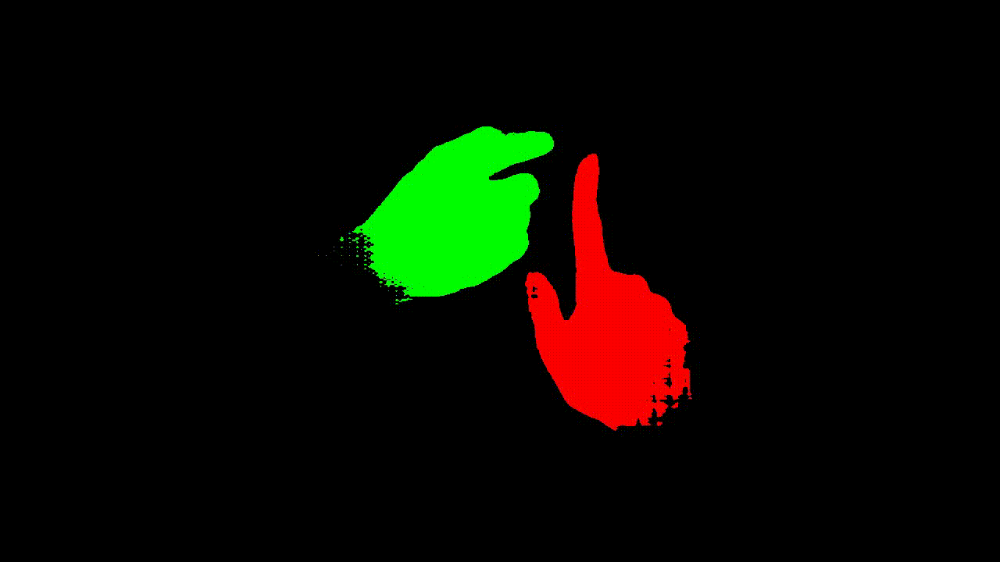

# HandTrack-SAM2

HandTrack-SAM2 is a Python-based project that implements an automatic pipeline for tracking hand movements in videos. It combines MediaPipe's hand detection with SAM2 (Segment Anything Model 2) for precise hand segmentation.




## Features

- Hand detection using MediaPipe
- Precise hand segmentation using SAM2
- Multiple output modes:
  - Mask-only visualization
  - Bounding box overlay
  - Combined mask and bounding box
  - Original video overlay options

## Installation

1. Clone the repository:

```bash
git clone https://github.com/Sir-Teo/HandTrack-SAM2.git

cd HandTrack-SAM2
```

2. Create and activate a conda environment:

```bash
conda create -n sam2 python=3.12
conda activate sam2
```

3. Install the required dependencies:

```bash
pip install -r requirements.txt
```

4. Download the SAM2 model weights:

follow the instructions in sam2 official repo: https://github.com/facebookresearch/segment-anything-2, and also download MediaPipe model weights and place them in the `models` folder.

5. Run the script:

```bash
python src/main.py \
--input_video_path "data/test.mp4" \
--output_video_path "output/hands_mask_only.mp4" \
--sam2_checkpoint "sam2/checkpoints/sam2.1_hiera_large.pt" \
--sam2_config "sam2/configs/sam2.1/sam2.1_hiera_l.yaml" \
--mediapipe_model_path "models/hand_landmarker.task"
```

### Multiple Output Configurations

```bash
python src/main.py \
--input_video_path "data/test.mp4" \
--output_video_path "output/hands_mask_only.mp4" \
--sam2_checkpoint "sam2/checkpoints/sam2.1_hiera_large.pt" \
--sam2_config "sam2/configs/sam2.1/sam2.1_hiera_l.yaml" \
--additional_runs \
'{"output_video_path":"output/hands_overlay.mp4","overlay_original":true}' \
'{"output_video_path":"output/hands_bbox_only.mp4","overlay_mode":"bbox"}'
```


### Using SLURM

If you have access to a SLURM cluster, you can use the provided script:

```bash
sbatch scripts/generate_mask.slurm
```


## Parameters

- `--input_video_path`: Path to the input video file
- `--output_video_path`: Path to save the output video
- `--sam2_checkpoint`: Path to the SAM2 checkpoint file
- `--sam2_config`: Path to the SAM2 config file
- `--tmp_dir`: Temporary directory for frame extraction (default: "./tmp_frames")
- `--max_frames`: Maximum number of frames to process (optional)
- `--mediapipe_model_path`: Path to MediaPipe hand landmarker model
- `--prompt_mode`: Mode for adding prompts ("box", "point", or "both")
- `--overlay_mode`: Output visualization mode ("none", "mask", "bbox", or "both")
- `--overlay_original`: Whether to overlay on original video (flag)

## Output Modes

1. Mask-only mode (`overlay_mode="mask", overlay_original=False`):
   - Shows colored masks on black background

2. Overlay mode (`overlay_mode="mask", overlay_original=True`):
   - Shows semi-transparent masks on original video

3. Bounding box mode (`overlay_mode="bbox"`):
   - Shows detection bounding boxes

4. Combined mode (`overlay_mode="both"`):
   - Shows both masks and bounding boxes

## License

## Acknowledgments

- SAM2 (Meta AI Research)
- MediaPipe (Google)